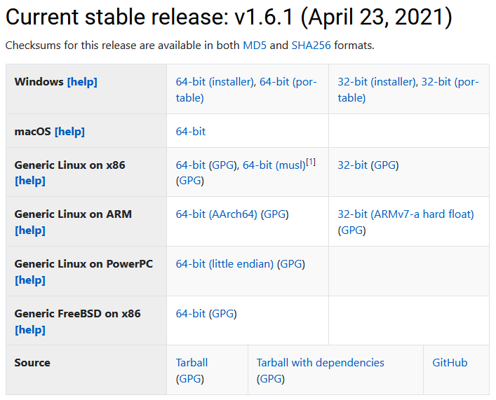

# 1章 Julia入門

Juliaは、PythonやMatlabのように動的型付けに対応しながらC言語のように早く動作させることができるほか、行列演算なども標準でサポートされており科学計算にも向いている。  
[Juliaのメリット](https://julialang.org/#Julia-in-a-Nutshell)  
新興プログラミング言語であるため普及率は高くないが今後その応用に期待されている。
Juliaのインストール方法などについて簡単にまとめる。  

## 1.1 Juliaとは

Juliaは速さとか書きやすさとかなんかすごいらしいですよ。[ホームページに書いてあった(Julia in a Nutshell)](https://julialang.org/)。  
Juliaはまだ普及段階ですが、某大学の線形代数の授業で使用されていたり、Google Colabで使用できる裏技が用意されていたり、ITのプロフェッショナル達からこっそり注目を集めています。  

行列の演算や高速な数値計算を行うとき、PythonではおまじないのようにNumpyをインポートしていましたがJuliaではその必要はありません。
基本的な行列演算はデフォルトでサポートされており、一部の統計処理や線形代数的な計算はパッケージをインポートする必要はありますがそのパッケージも標準で搭載してあります。  
また、パッケージマネージャもJulia自身に内蔵されており、Pythonの用にpipとcondaどちらを使うべきか、pipとconda一方でしかインストールできないパッケージがあったり環境が混ざって壊れてしまうという心配がありません。  

一方で、JuliaはC言語のように早く動作すると謳ってはいるものの、プログラマの記述方法に依存している、つまり、Julia言語らしい早く動作する書き方が存在しており実際に動作速度を向上させるためにはJulia言語独特の仕様を理解する必要があります。  

JuliaではJulia言語自体を用いて開発されているFluxというディープラーニングパッケージもあり、研究開発やデータサイエンスといった分野で将来存分に活躍しうるポテンシャルを持っているといえるでしょう。

## 1.2 Juliaのインストール

ここではJuliaのインストールに際して注意する点を記述します。  
このリポジトリで用いる環境は次の通りです。

* Julia 1.6.1
* Plots (backend GR)

Plotsについては後述します。  
PyPlotなどを用いたい場合は適宜読み替えてください。

これから初めてJuliaをインストールするという方を対象に、Juliaのインストール方法を説明します。  
上記の要件を満たしている方は読み飛ばしてください。

### 1.2.1 Juliaのバージョン

Juliaのバージョンは執筆時点で最新のVer.1.6.1を使用します(2021/07)。  

  
[Juliaのダウンロードページ](https://julialang.org/downloads/)からOSに対応したバイナリをダウンロードしてインストールしましょう。

インストール後はパスを通すために以下の環境変数を作成しPATHに追加してください。
* `JULIA_BINDIR`：*`Juliaをインストールしたディレクトリ`*/julia-1.6.1/bin

|# Note|
|:-|
|Juliaにて設定できる環境変数の詳細は[Documents](https://docs.julialang.org/en/v1/)を参照してください。|
|https://docs.julialang.org/en/v1/manual/environment-variables/|

|# Tips|
|:-|
|SSDに細かいファイルを大量に書き込みたくない！という方は環境変数[`JULIA_DEPOT_PATH`](https://docs.julialang.org/en/v1/manual/environment-variables/#JULIA_DEPOT_PATH)を追加することで設定ファイルやパッケージがインストールされるディレクトリを変更することができます。|

### 1.2.2 使用する外部ライブラリ

書籍の目標とすることは、ゼロからディープラーニングを実装することです。  
そのため、外部のライブラリは極力使用しないというのが方針ですが、
[Plots](http://docs.juliaplots.org)
ライブラリは例外として用いることにします。  

Plots はグラフ描画のためのライブラリです。  
Plots を用いれば、実験結果の可視化や、また、ディープラーニングの実行途中のデータを視覚的に確認することができます。

## 1.3 Juliaインタプリンタ

Juliaをインストールしたら、Juliaのバージョンをまず初めに確認します。  
ターミナル（Windowsの場合はコマンドプロンプト）を開き、`julia --version`というコマンドを入力してみましょう。  
このコマンドは、インストールされたJuliaのバージョンを出力します。

``` console
$ julia --version
julia version 1.6.1
```

上のように、julia version 1.6.1と表示されていたら、正常にインストールされています。  
続いて、`julia`と入力し、Juliaインタプリンタを起動します。

``` console
$ julia
               _
   _       _ _(_)_     |  Documentation: https://docs.julialang.org
  (_)     | (_) (_)    |
   _ _   _| |_  __ _   |  Type "?" for help, "]?" for Pkg help.    
  | | | | | | |/ _` |  |
  | | |_| | | | (_| |  |  Version 1.6.1 (2021-04-23)
 _/ |\__'_|_|_|\__'_|  |  Official https://julialang.org/ release  
|__/                   |

julia> 
```

Juliaインタプリンタは「
[インタラクティブモード](https://docs.julialang.org/en/v1/stdlib/REPL/)
」とも呼ばれ、ユーザーとJuliaが対話的にプログラミングを行うことができます。  
対話的というのは、たとえば、ユーザーが「1+2は?」と尋ねれば、Juliaインタプリンタが「3です」と答えるようなやり取りが行えることを意味します。  
それでは、実際に入力してみます。

```julia
julia> 1 + 2
3
```
このように、Juliaインタプリンタでは、対話的に（インタラクティブに）プログラミングを行うことができます。  
ここでは、このインタラクティブモードを使って、Juliaプログラミングの簡単な例を見ていくことにします。

