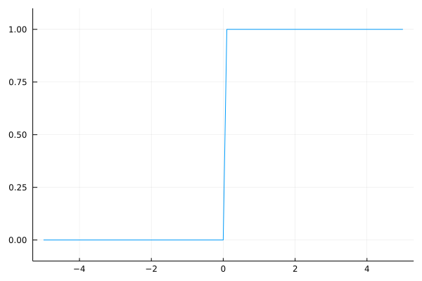
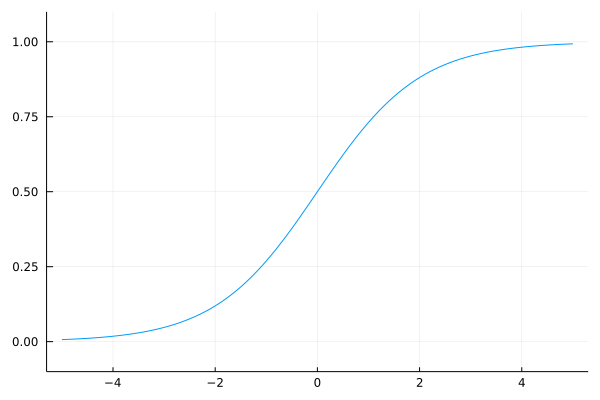
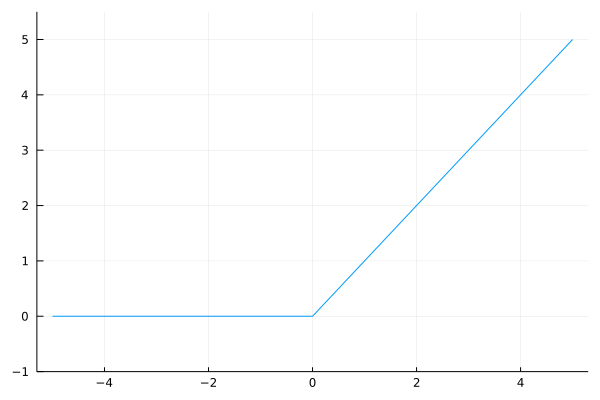

# 3章 ニューラルネットワーク

前章ではパーセプトロンについて学びましたが、パーセプトロンについては良いニュースと悪いニュースがありました。  
～  

## 3.1 パーセプトロンからニューラルネットワークへ
### 3.1.1 ニューラルネットワークの例
### 3.1.2 パーセプトロンの復習
### 3.1.3 活性化関数の登場
## 3.2 活性化関数
### 3.2.1 シグモイド関数
### 3.2.2 ステップ関数の実装

ここではJuliaを使ってステップ関数をグラフで表します。  
～  

```julia
function step_function(x)
    if x > 0
        return 1
    else
        return 0
    end
end
```

この実装は単純で分かりやすいのですが、引数の`x`は実数しか入力することができません。  
つまり、`step_function(3.0)`といった使い方はできますが、配列を引数に取るような使い方──たとえば、`step_function([1.0, 2.0])`のような使い方──はできないのです。  
しかし、[1.5.2節](./md/ch01.md#152-単純なグラフ描画)の内容を思い出してください。  

> これはsin関数がスカラ値に対して作用する関数であるためです。  
> このような関数を配列の各要素を対象に実行したい場合は関数名と引数の間に`.`を入れ、`sin.(x)`とすることで実行することができます。  

この関数も同様で、`step_function.([1.0, 2.0])`とすることで動作させることができます。  

ですが、書籍ではPythonの型変換について記載されるのでそれをもう少しなぞって実装します。  
Juliaでは関数名の後に`.`を付けることで関数のブロードキャストができるため、関数の配列への対応はしません。  
しかし、Juliaでは型の推論を行わせないように工夫して記述することで実行速度を早くすることができることと、さらに入力値や返り値など計算に用いられる一連の型が一致していると都合がよいため、型を変換されるように実装します。  

```julia
function step_function(x)
    return typeof(x)(x > 0)
end
```

上の関数はたったの1行ですが、Juliaの便利な”トリック”を使っているため、少しわかりにくいかもしれません。  
ここでは、どのようなトリックを使っているのか、次のJulia REPLの例を見ながら説明します。  
次の例では、`x`という配列を用意し、その配列に対して不等号による演算を行います。  

```julia
julia> x = [-1.0, 1.0, 2.0]
3-element Vector{Float64}:
 -1.0
  1.0
  2.0

julia> y = x > 0
ERROR: MethodError: no method matching isless(::Int64, ::Vector{Float64})
Closest candidates are:
  isless(::AbstractVector{T} where T, ::AbstractVector{T} where T) at abstractarray.jl:1989
  isless(::Any, ::Missing) at missing.jl:88
  isless(::Missing, ::Any) at missing.jl:87
  ...
Stacktrace:
 [1] <(x::Int64, y::Vector{Float64})
   @ Base .\operators.jl:279
 [2] >(x::Vector{Float64}, y::Int64)
   @ Base .\operators.jl:305
 [3] top-level scope
   @ REPL[2]:1

julia> y = x .> 0
3-element BitVector:
 0
 1
 1
```

配列に対して不等号の演算を行う場合も[同様](./md/ch01.md#137-ブロードキャスト)で、演算子の前に`.`を付けます。  
> 算術演算を行う際に各演算子の前に`.`（ドット）を付けるとブロードキャスト演算子として扱われます。

そうすると各要素に対して不等号の演算が行われ、BitVectorが生成されます。  

ここでは、`x`という配列の要素に対して0より大きい要素は1に、0以下の場合は0に変換され、新しい配列`y`が生成されます。  

さて、私たちの望むステップ関数は、0か1の「`x`と同じ型」を出力する関数です。  
そのため、配列`y`の型をBitVectorからxの配列の型に変換します。  

```julia
julia> typeof(x)
Vector{Float64} (alias for Array{Float64, 1})

julia> typeof(x)(y)
3-element Vector{Float64}:
 0.0
 1.0
 1.0
```

以前示した通り、`typeof()`関数を用いることで変数の型を求めることができます。  
`typeof()`関数で取得した型に入力することで変換することができます。  

関数自体を配列に対応させることもできますが、`.`を用いることでブロードキャストができることを覚えておけば、関数を作成する際にはそのような心配をする必要はなくなります。  
（詳細は省きますが、スカラ値のみに対応した形で記述して関数名の後に`.`を付けて実行した場合のほうが動作も早くなります。）  
以上が、ステップ関数の実装で使われるJuliaの”トリック”でした。  

### 3.2.3 ステップ関数のグラフ

それでは、上で定義したステップ関数をグラフで表してみましょう。  
そのために、パッケージの`Plots`を使用します。  

```julia
using Plots

function step_function(x)
    return typeof(x)(x > 0)
end

X = range(-5.0, 5.0, step=0.1)
Y = step_function.(X)
plot(X, Y, leg = false)
plot!(ylims = (-0.1, 1.1))  # y軸の範囲を指定
```

～  
この`x`、`y`配列をプロットすると、結果は次の**図3－6**のようになります。  

  
図3-6　ステップ関数のグラフ  

～  

### 3.2.4 シグモイド関数の実装

続いてシグモイド関数を実装しましょう。  
～  

```julia
function sigmoid(x)
    return 1 / (1 + exp(-x))    
end
```

ここで`exp(-x)`は

に対応します。  
eはネイピア数の2.7182...の実数を表します。  
～  

それでは、シグモイド関数をグラフに描画します。  
～  

```julia
x = range(-5.0, 5.0, step=0.1)
y = sigmoid.(x)
plot(x, y, leg = false)
plot!(ylims = (-0.1, 1.1))  # y軸の範囲を指定
```

上のコードを実行すると、**図3-7**のグラフが得られます。  

  
図3-7　シグモイド関数のグラフ

### 3.2.5 シグモイド関数とステップ関数の比較
### 3.2.6 非線形関数
### 3.2.7 ReLU関数

これまでに、活性化関数としてステップ関数とシグモイド関数を紹介しました。  
～  

  
図3-9　ReLU関数  

～  

```julia
function relu(x)
    return max(0, x)
end
```

ここでは、`max`という関数を使っています。  
この`max`は、入力された値から大きいほうの値を選んで出力する関数です。  
～  

## 3.3 多次元配列の計算

多次元配列を使った計算をマスターすれば、ニューラルネットワークの実装を効率的に進めることができます。  
～  

### 3.3.1 多次元配列

多次元配列とは、簡単に言うと「数字の集合」です。  
～  

```julia
julia> A = [1, 2, 3, 4]
4-element Vector{Int64}:
 1
 2
 3
 4

julia> ndims(A)
1

julia> size(A)
(4,)

julia> size(A, 1)
4
```

ここで示すように、配列の次元数は`ndims()`関数で取得できます。  
また、配列の形状は`size()`関数で取得できます。  
～  
それでは続いて2次元の配列を作成します。  

```julia
julia> B = [1 2; 3 4; 5 6]
3×2 Matrix{Int64}:
 1  2
 3  4
 5  6

julia> ndims(B)
2

julia> size(B)
(3, 2)
```

ここでは、「3×2の配列」である`B`を作成しています。  
～  

### 3.3.2 行列の積

～  

```julia
julia> A = [1 2; 3 4]
2×2 Matrix{Int64}:
 1  2
 3  4

julia> B = [5 6; 7 8]
2×2 Matrix{Int64}:
 5  6
 7  8

julia> A * B
2×2 Matrix{Int64}:
 19  22
 43  50
```

～  

```julia
julia> A = [1 2 3; 4 5 6]
2×3 Matrix{Int64}:
 1  2  3
 4  5  6

julia> B = [1 2; 3 4; 5 6]
3×2 Matrix{Int64}:
 1  2
 3  4
 5  6

julia> A * B
2×2 Matrix{Int64}:
 22  28
 49  64

julia> C = [1 2; 3 4]
2×2 Matrix{Int64}:
 1  2
 3  4

julia> A * C
ERROR: DimensionMismatch("matrix A has dimensions (2,3), matrix B has dimensions (2,2)")
Stacktrace:
 [1] _generic_matmatmul!(C::Matrix{Int64}, tA::Char, tB::Char, A::Matrix{Int64}, B::Matrix{Int64}, _add::LinearAlgebra.MulAddMul{true, true, Bool, Bool})
   @ LinearAlgebra C:\buildbot\worker\package_win64\build\usr\share\julia\stdlib\v1.6\LinearAlgebra\src\matmul.jl:814
 [2] generic_matmatmul!(C::Matrix{Int64}, tA::Char, tB::Char, A::Matrix{Int64}, B::Matrix{Int64}, _add::LinearAlgebra.MulAddMul{true, true, Bool, Bool})
   @ LinearAlgebra C:\buildbot\worker\package_win64\build\usr\share\julia\stdlib\v1.6\LinearAlgebra\src\matmul.jl:802
 [3] mul!
   @ C:\buildbot\worker\package_win64\build\usr\share\julia\stdlib\v1.6\LinearAlgebra\src\matmul.jl:302 [inlined]
 [4] mul!
   @ C:\buildbot\worker\package_win64\build\usr\share\julia\stdlib\v1.6\LinearAlgebra\src\matmul.jl:275 [inlined]
 [5] *(A::Matrix{Int64}, B::Matrix{Int64})
   @ LinearAlgebra C:\buildbot\worker\package_win64\build\usr\share\julia\stdlib\v1.6\LinearAlgebra\src\matmul.jl:153
 [6] top-level scope
   @ REPL[16]:1
```

～  

```julia
julia> A = [1 2; 3 4; 5 6]
3×2 Matrix{Int64}:
 1  2
 3  4
 5  6

julia> B = [7, 8]
2-element Vector{Int64}:
 7
 8

julia> A * B
3-element Vector{Int64}:
 23
 53
 83
```

～  

### 3.3.3 ニューラルネットワークの行列の積

それでは、行列を使ってニューラルネットワークの実装を行いましょう。  
～  

```julia
julia> X = [1 2]
1×2 Matrix{Int64}:
 1  2

julia> W = [1 3 5; 2 4 6]
2×3 Matrix{Int64}:
 1  3  5
 2  4  6

julia> Y = X * W
1×3 Matrix{Int64}:
 5  11  17
```

～  

## 3.4 3層ニューラルネットワーク
### 3.4.1 記号の確認
### 3.4.2 各層における信号伝達の実装
それでは、入力層から「第1層目の1番目のニューロン・への信号の伝達を見ていきます。  
～  

```julia
X = [1.0 0.5]
W1 = [0.1 0.3 0.5; 0.2 0.4 0.6]
B1 = [0.1 0.2 0.3]

print(size(W1)) # (2, 3)
print(size(X))  # (1, 2)
print(size(B1)) # (1, 3)

A1 = X * W1 + B1
```

この計算は前節で行った計算と同じです。  
～  

```julia
Z1 = sigmoid.(A1)

print(A1) # [0.3 0.7 1.1]
print(Z1) # [0.574442516811659 0.6681877721681662 0.7502601055951177]
```

この`sigmoid()`関数は。前に定義した関数です。  
～  

```julia
W2 = [0.1 0.4; 0.2 0.5; 0.3 0.6]
B2 = [0.1 0.2]

print(size(Z1)) # (1, 3)
print(size(W2)) # (3, 2)
print(size(B2)) # (1, 2)

A2 = Z1 * W2 + B2
Z2 = sigmoid.(A2)
```

この実装は、第1層の出力（`Z1`）が第2層への入力になっている点を除けば、先ほどの実装とまったく同じです。  
～  

```julia
function identity_function(x)
    return x
end

W3 = [0.1 0.3; 0.2 0.4]
B3 = [0.1 0.2]

A3 = Z2 * W3 + B3
Y = identity_function.(A3)
```

ここでは、`identity_function()`という関数を定義して、この関数──これを「恒等関数」といいます。──を出力層の活性化関数として出力します。  
～  

### 3.4.3 実装のまとめ

これで3層ニューラルネットワークの説明は終わりです。  
～  

```julia
function init_network()
    network = Dict()
    network["W1"] = [0.1 0.3 0.5; 0.2 0.4 0.6]
    network["b1"] = [0.1 0.2 0.3]
    network["W2"] = [0.1 0.4; 0.2 0.5; 0.3 0.6]
    network["b2"] = [0.1 0.2]
    network["W3"] = [0.1 0.3; 0.2 0.4]
    network["b3"] = [0.1 0.2]
    
    return network
end

function forward(network, x)
    W1, W2, W3 = network["W1"], network["W2"], network["W3"]
    b1 ,b2 ,b3 = network["b1"], network["b2"], network["b3"]

    a1 = x * W1 + b1
    z1 = sigmoid.(a1)
    a2 = z1 * W2 + b2
    z2 = sigmoid.(a2)
    a3 = z2 * W3 + b3
    y = identity_function.(a3)

    return y
end

network = init_network()
x = [1.0 0.5]
y = forward(network, x)
print(y) # [0.3168270764110298 0.6962790898619668]
```

ここでは、`init_network()`、`forward()`という関数を定義しています。  
～  

## 3.5 出力層の設計
### 3.5.1 恒等関数とソフトマックス関数

～  
それでは、ソフトマックス関数を実装しましょう。  
～  

```julia
julia> a = [0.3 2.9 4.0];

julia> exp_a = exp.(a) # 指数関数
1×3 Matrix{Float64}:
 1.34986  18.1741  54.5982

julia> sum_exp_a = sum(exp_a) # 指数関数の和
74.1221542101633

julia> y = exp_a / sum_exp_a
1×3 Matrix{Float64}:
 0.0182113  0.245192  0.736597
```

～  

```julia
function softmax(a)
    exp_a = exp.(a)
    sum_exp_a = sum(exp_a)
    y = exp_a / sum_exp_a

    return y
end
```

### 3.5.2 ソフトマックス関数の実装上の注意

上の`softmax`関数の実装は、コンピュータで計算を行う上では欠陥があります。 
～  

```julia
julia> a = [1010 1000 990];

julia> exp.(a) / sum(exp.(a)) # ソフトマックス関数の計算
1×3 Matrix{Float64}:
 NaN  NaN  NaN                # 正しく計算されない

julia> c = maximum(a);

julia> a .- c
1×3 Matrix{Int64}:
 0  -10  -20

julia> exp.(a .- c) / sum(exp.(a .- c))
1×3 Matrix{Float64}:
 0.999955  4.53979e-5  2.06106e-9
 ```

～  

```julia
function softmax(a)
    c = maximum(a)
    exp_a = exp.(a .- c) # オーバーフロー対策
    sum_exp_a = sum(exp_a)
    y = exp_a / sum_exp_a

    return y
end
```

### 3.5.3 ソフトマックス関数の特徴
### 3.5.4 出力層のニューロンの数

## 3.6 手書き数字認識
### 3.6.1 MNISTデータセット

ここで使用するデータセットはMNISTという手書き数字の画像セットです。  
～  
このリポジトリでは、MNISTデータセットのダウンロードから画像データの配列への変換までをサポートする便利なスクリプトを提供します（`dataset`ディレクトリ内の`mnist_dl.jl`がダウンロードとHDF5での保存、`mnist.jl`はHDF5からの読み出し）。  
この`mnist.jl`の関数`load_mnist()`を用いれば、MNISTデータを次のように簡単に読み込むことができます。  

```julia
include("dataset/mnist.jl")

(x_train, t_train), (x_test, t_test) = load_mnist(flatten=true, normalize=false)

# それぞれのデータの形状を出力
print(size(x_train)) # (60000, 784)
print(size(t_train)) # (60000,)
print(size(x_test))  # (10000, 784)
print(size(t_test))  # (10000,)
```

～  

それでは、データの確認も兼ねて、MNIST画像を表示させてみることにします。  
～  

```julia
using Plots
include("dataset/mnist.jl")

(x_train, t_train), (x_test, t_test) = load_mnist(flatten=true, normalize=false)

img = x_train[1, :]
label = t_train[1]
print(label) # 5

print(size(img))           # (784,)
img = reshape(img, 28, 28) # 形状を元の画像サイズに変形
print(size(img))           # (28, 28)

plot(size=(100,100), colorbar=false, ticks = nothing)
heatmap!(img'[end:-1:1,:], color=:grays) # 見た目が反転してしまうので調整
```

～  

### 3.6.2 ニューラルネットワークの推論処理

それでは、このMNISTデータセットに対して、推論処理を行うニューラルネットワークを実装しましょう。  
～  

```julia
function get_data()
    (x_train, t_train), (x_test, t_test) = load_mnist(normalize=true, flatten=true, one_hot_label=false)
    return x_test, t_test
end

function init_network()
    network = Dict()
    for (k, v) in key_file
        network[k] = HDF5.h5read("sample_weight.h5", k)
    end
    return network
end

function predict(network, x)
    W1, W2, W3 = network["W1"], network["W2"], network["W3"]
    b1, b2, b3 = network["b1"], network["b2"], network["b3"]

    a1 = x * W1 + b1
    z1 = sigmoid.(a1)
    a2 = z1 * W2 + b2
    z2 = sigmoid.(a2)
    a3 = z2 * W3 + b3
    y = softmax(a3)

    return y
end
```

～  

```julia
x, t = get_data()
network = init_network()

accuracy_cnt = 0
for i in 1:size(x, 1)
    y = predict(network, reshape(x[i,:], 1, :))
    p = argmax(y) # 最も確率の高い要素のインデックスを取得
    if typeof(t)(p) == t[i]
        accuracy_cnt += 1
    end
end

print("Accuracy:$(accuracy_cnt / size(x,1))")
```

～  
