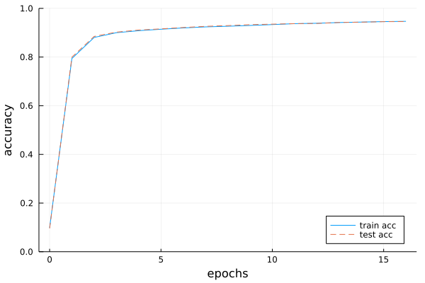

# 4章 ニューラルネットワークの学習

本章のテーマは、ニューラルネットワークの学習です。  
～  

## 4.1 データから学習する
### 4.1.1 データ駆動
### 4.1.2 訓練データとテストデータ
## 4.2 損失関数
### 4.2.1 2乗和誤差

損失関数として用いられる関数はいくつかありますが、もっとも有名ななものは**2乗和誤差**（sum of squared error）でしょう。  
～  

```julia
julia> y = [0.1, 0.05, 0.6, 0.0, 0.05, 0.1, 0.0, 0.1, 0.0, 0.0];

julia> t = [0, 0, 1, 0, 0, 0, 0, 0, 0, 0];

```

～  

```julia
function sum_squared_error(y, t)
    return 0.5 * sum((y-t).^2)
end
```

～  

```julia
julia> # 「3」を正解とする

julia> t = [0, 0, 1, 0, 0, 0, 0, 0, 0, 0];

julia>

julia> # 例１：「3」の確率が最も高い場合（0.6）

julia> y = [0.1, 0.05, 0.6, 0.0, 0.05, 0.1, 0.0, 0.1, 0.0, 0.0];

julia> sum_squared_error(y, t)
0.09750000000000003

julia>

julia> # 例１：「7」の確率が最も高い場合（0.6）

julia> y = [0.1, 0.05, 0.1, 0.0, 0.05, 0.1, 0.0, 0.6, 0.0, 0.0];

julia> sum_squared_error(y, t)
0.5974999999999999
```

ここでは2つの例を示しています。  
～  

### 4.2.2 交差エントロピー誤差

2乗和誤差と別の損失関数として、**交差エントロピー誤差**（cross entropy error）もよく用いられます。  
～  

```julia
julia> function cross_entropy_error(y, t)
           delta = 1.e-7
           return -sum(t .* log.(y .+ delta))
       end
cross_entropy_error (generic function with 1 method)

```

～  

```julia
julia> t = [0, 0, 1, 0, 0, 0, 0, 0, 0, 0];

julia> y = [0.1, 0.05, 0.6, 0.0, 0.05, 0.1, 0.0, 0.1, 0.0, 0.0];

julia> cross_entropy_error(y, t)
0.510825457099338

julia>

julia> y = [0.1, 0.05, 0.1, 0.0, 0.05, 0.1, 0.0, 0.6, 0.0, 0.0];

julia> cross_entropy_error(y, t)
2.302584092994546
```

～  

### 4.2.3 ミニバッチ処理

～  

```julia
include("dataset/mnist.jl") # load_mnist()

(x_train, t_train), (x_test, t_test) = load_mnist(normalize=true, one_hot_label=true)

print(size(x_train)) # (60000, 784)
print(size(t_train)) # (60000, 10)
```

～  
それでは、この訓練データの中からランダムに10枚だけ抜き出すには、どうすればよいのでしょうか？  
～  

```julia
import Random: shuffle
train_size = size(t_train, 1)
batsh_size = 10
batch_mask = shuffle(1:train_size)[1:batch_size]
x_batch = x_train[batch_mask]
t_batch = t_train[batch_mask]
```

～  

```julia
julia> import Random: shuffle

julia> shuffle(1:60000)[1:10]
10-element Vector{Int64}:
  8130
 17124
 36096
 52441
 21595
 23334
 25369
 46353
 52087
  6978
```

### 4.2.4 \[バッチ対応版\] 交差エントロピー誤差の実装

では、ミニバッチのようなデータに対応した交差エントロピー誤差はどのように実装できるでしょうか？  
これは、先ほど実装した交差エントロピー誤差──それはひとつのデータを対象とした誤差でした──を改良することで簡単に実装できます。  
ここでは、データがひとつの場合と、データがバッチとしてまとめられて入力される場合の両方のケースを多重ディスパッチで実装します。  

```julia
julia> function cross_entropy_error(y::Vector{T}, t) where T
            delta = 1.e-7
            return -sum(t .* log.(y .+ delta))
       end
cross_entropy_error (generic function with 1 method)

julia> function cross_entropy_error(y::Matrix{T}, t) where T
            batch_size = size(y, 1)
            return sum(cross_entropy_error.([y[i,:] for i=1:batch_size], [t[i,:] for i=1:batch_size])) / batch_size
       end
cross_entropy_error (generic function with 2 methods)
```

～  
また、教師データがラベルとして与えられたとき（one-hot表現ではなく、「2」や「7」といったラベルとして与えられたとき）、交差エントロピー誤差は次のように実装することができます。  

```julia
function cross_entropy_error(y::Vector{T}, t::Y) where T <: Real where Y <: Integer
    delta = 1.e-7
    return -log.(y[t] .+ delta)
end

function cross_entropy_error(y::Matrix{T}, t::Vector{Y}) where T <: Real where Y <: Integer
    batch_size = size(y, 1)
    return sum(cross_entropy_error.([y[i,:] for i=1:batch_size], [t[i] for i=1:batch_size])) / batch_size
end
```

実装のポイントは、one-hot表現で`t`が0の要素は、交差エントロピー誤差も0であるから、その計算は無視してもよいということです。  
～  

### 4.2.5 なぜ損失関数を設定するのか？

～  

## 4.3 数値微分
### 4.3.1 微分

～  

```julia
# 悪い実装例
function numerical_diff(f, x)
    h = 1e-50
    return (f(x+h) - f(x)) / h
end
```

～  

```julia
julia> Float32(10e-50)
0.0f0
```

～  

```julia
function numerical_diff(f, x)
    h = 1e-4
    return (f(x+h) - f(x-h)) / 2h
end
```

### 4.3.2 数値微分の例

～  

```julia
function function_1(x)
    return 0.01x^2 + 0.1x
end
```

続いてこの関数を描画します。  
～  

```julia
using Plots

x = 0:0.1:20
y = function_1.(x)

plot(xlabel="x", ylabel="f(x)", leg=false)
plot!(x, y)
```

～  

```julia
julia> numerical_diff(function_1, 5)
0.1999999999990898

julia> numerical_diff(function_1, 10)
0.2999999999986347
```

### 4.3.3 偏微分

～  

```julia
function function_2(x)
    return x[0]^2 + x[1]^2
    # または return sum(x.^2)
end
```

～  

**問1**：x0=3、x1=4のときのx0に対する偏微分を求めよ。  

```julia
julia> function function_tmp1(x0)
           return x0^2 + 4.0^2
       end
function_tmp1 (generic function with 1 method)

julia> numerical_diff(function_tmp1, 3.0)
6.00000000000378
```

**問2**：x0=3、x1=4のときのx1に対する偏微分を求めよ。  

```julia
julia> function function_tmp2(x1)
           return 3.0^2 + x1^2
       end
function_tmp2 (generic function with 1 method)

julia> numerical_diff(function_tmp2, 4.0)
7.999999999999119
```

これらの問題では、変数がひとつだけの関数を定義して、その関数について微分を求めるような実装を行っています。  
～  

## 4.4 勾配

先の例では、x0とx1の偏微分の計算を変数ごとに計算しました。  
～  

```julia
function numerical_gradient(f, x)
    h = 1e-4  # 0.0001
    grad = zero(x) # xと同じ形状の配列を生成
    
    for idx = 1:size(x,1)
        tmp_val = x[idx]
        # f(x+h) の計算
        x[idx] += h
        fxh1 = f(x)  
        
        # f(x-h) の計算
        x[idx] -= 2h 
        fxh2 = f(x)

        grad[idx] = (fxh1 - fxh2) / 2h
        x[idx] = tmp_val  # 値を元に戻す
    end
    return grad
end
```

～  

```julia
julia> numerical_gradient(function_2, [3.0, 4.0])
2-element Vector{Float64}:
 5.9999999999860165
 7.999999999999119

julia> numerical_gradient(function_2, [0.0, 2.0])
2-element Vector{Float64}:
 0.0
 3.9999999999995595

julia> numerical_gradient(function_2, [3.0, 0.0])
2-element Vector{Float64}:
 5.999999999994898
 0.0
```

～  

### 4.4.1 勾配法

～  

```julia
function gradient_descent(f, init_x; lr=0.01, step_num=100)
    x = init_x

    for i = 1:step_num
        grad = numerical_gradient(f, x)
        x .-= lr * grad
    end
    return x
end
```

引数の`f`は最適化したい関数、`init_x`は初期値、`lr`はlearning rateを意味する学習率、`step_num`は勾配法による繰り返しの数とします。  
～  

**問**：f(x0,x1)＝x0^2+x1^2の最小値を勾配法で求めよ。

```julia
julia> function function_2(x)
           return x[0]^2 + x[1]^2
       end
function_2 (generic function with 2 methods)

julia> init_x = [-3.0, 4.0]
2-element Vector{Float64}:
 -3.0
  4.0

julia> gradient_descent(function_2, init_x, lr=0.1, step_num=100)
2-element Vector{Float64}:
 -6.111107929002627e-10
  8.148143905330748e-10
```

～  

```julia
# 学習率が大きすぎる例：lr=10.0
julia> init_x = [-3.0, 4.0];

julia> gradient_descent(function_2, init_x, lr=10.0, step_num=100)
2-element Vector{Float64}:
 9.453764611121996e11
 2.56007253831004e13

# 学習率が大きすぎる例：lr=1e-10
julia> init_x = [-3.0, 4.0];

julia> gradient_descent(function_2, init_x, lr=1e-10, step_num=100)
2-element Vector{Float64}:
 -2.999999939999995
  3.9999999199999934
```

### 4.4.2 ニューラルネットワークに対する勾配

ニューラルネットワークの学習においても、勾配を求める必要があります。  
～  

```julia
include("common/functions.jl") # softmax, cross_entropy_error
include("common/gradient.jl")  # numerical_gradient


struct SimpleNet
    W::Matrix{T} where T <: AbstractFloat
end

SimpleNet() = SimpleNet(randn(2,3))

function predict(self::SimpleNet, x)
    return x*self.W
end

function loss(self::SimpleNet, x, t)
    z = predict(self, x)
    y = softmax(z)
    loss = cross_entropy_error(y, t)
    
    return loss
end
```

～  

```julia
julia> net = SimpleNet()
SimpleNet([0.8614474575097301 -1.0564545610725369 1.5079058577423168; 0.05480306208407878 0.15211432230030267 1.147686557481568])

julia> net = SimpleNet([0.47355232 0.9977393 0.84668094; 0.85557411 0.03563661 0.69422093])
SimpleNet([0.47355232 0.9977393 0.84668094; 0.85557411 0.03563661 0.69422093])

julia> net.W
2×3 Matrix{Float64}:
 0.473552  0.997739   0.846681
 0.855574  0.0356366  0.694221

julia>

julia> x = [0.6 0.9]
1×2 Matrix{Float64}:
 0.6  0.9

julia> p = predict(net, x)
1×3 Matrix{Float64}:
 1.05415  0.630717  1.13281

julia> argmax(p)
CartesianIndex(1, 3)

julia>

julia> t = [0.0 0.0 1.0]
1×3 Matrix{Float64}:
 0.0  0.0  1.0

julia> loss(net, x, t)
0.9280682857864075
```

続いて、勾配を求めてみましょう。  
～  

```julia
julia> function f(W)
           return loss(net, x, t)
       end
f (generic function with 1 method)

julia> dW = numerical_gradient(f, net.W)
2×3 Matrix{Float64}:
 0.219248  0.143562  -0.36281
 0.328871  0.215344  -0.544215
```

～  
なお、上の実装では、新しい関数を定義するために、「`function f(x)` ...」のように書きましたが、Juliaでは**ラムダ式**という記法を使って書くこともできます。  
たとえば、ラムダ式を使って次のように実装することもできます。  

```julia
julia> f = (w)->loss(net, x, t)
#1 (generic function with 1 method)

julia> dW = numerical_gradient(f, net.W)
```

## 4.5 学習アルゴリズムの実装
### 4.5.1 2層ニューラルネットワークの構造体

```julia
include("common/functions.jl")
include("common/gradient.jl") # numerical_gradient

mutable struct TwoLayerNet
    params::Dict
end 

function TwoLayerNet(input_size, hidden_size, output_size, weight_init_std=0.01)
    params = Dict()
    params["W1"] = weight_init_std * randn(input_size, hidden_size)
    params["b1"] = zeros(1, hidden_size)
    params["W2"] = weight_init_std * randn(hidden_size, output_size)
    params["b2"] = zeros(1, output_size)

    return TwoLayerNet(params)
end

function predict(self::TwoLayerNet, x)
    W1, W2 = self.params["W1"], self.params["W2"]
    b1, b2 = self.params["b1"], self.params["b2"]
    
    a1 = x * W1 .+ b1
    z1 = sigmoid.(a1)
    a2 = z1 * W2 .+ b2
    y = softmax(a2)

    return y
end

# x:入力データ, t:教師データ
function loss(self::TwoLayerNet, x, t)
    y = predict(self, x)    
    return cross_entropy_error(y, t)
end
    
function accuracy(self::TwoLayerNet, x, t)
    y = self.predict(self, x)
    y = argmax(y, dims=2)
    t = argmax(t, dims=2)
    
    accuracy = sum(y .== t) / size(x, 1)
    return accuracy
end

# x:入力データ, t:教師データ
function numerical_gradient(self::TwoLayerNet, x, t)
    loss_W = (W)->loss(self, x, t)
    
    grads = Dict()
    grads["W1"] = numerical_gradient(loss_W, self.params["W1"])
    grads["b1"] = numerical_gradient(loss_W, self.params["b1"])
    grads["W2"] = numerical_gradient(loss_W, self.params["W2"])
    grads["b2"] = numerical_gradient(loss_W, self.params["b2"])
    
    return grads
end
```

～  

```julia
net = TwoLayerNet(784, 100,10)
size(net.params["W1"]) # (784, 100)
size(net.params["b1"]) # (  1, 100)
size(net.params["W2"]) # (100, 10)
size(net.params["b2"]) # (  1, 10)
```

～  

```julia
x = rand(100,784) # ダミーの入力データ（100枚分）
y = predict(net,x)
```

～  

```julia
x = rand(100,784) # ダミーの入力データ（100枚分）
t = rand(100,10)  # ダミーの正解ラベル（100枚分）

grads = numerical_gradient(net, x, t) # 勾配を計算

size(grads["W1"]) # (784, 100)
size(grads["b1"]) # (  1, 100)
size(grads["W2"]) # (100, 10)
size(grads["b2"]) # (  1, 10)
```

～  

### 4.5.2 ミニバッチ学習の実装

```julia
import Random: shuffle
using Plots
include("dataset/mnist.jl") # load_mnist
include("ch04/two_layer_net.jl") # TwoLayerNet

# データの読み込み
(x_train, t_train), (x_test, t_test) = load_mnist(normalize=true, one_hot_label=true)

train_loss_list = zeros(0)

# ハイパーパラメータ
iters_num = 10000
train_size = size(x_train, 1)
batch_size = 100
learning_rate = 0.1

network = TwoLayerNet(784, 50, 10)

for i in 0:iters_num
    # ミニバッチの取得
    batch_mask = shuffle(1:train_size)[1:batch_size]
    x_batch = x_train[batch_mask, :]
    t_batch = t_train[batch_mask, :]
    
    # 勾配の計算
    grad = numerical_gradient(network, x_batch, t_batch)
    # grad = gradient(network, x_batch, t_batch)
    
    # パラメータの更新
    for key=("W1", "b1", "W2", "b2")
        network.params[key] -= learning_rate * grad[key]
    end

    loss_val = loss(network, x_batch, t_batch)
    append!(train_loss_list, loss_val)
end
```

### 4.5.3 テストデータで評価

```julia
import Random: shuffle
using Plots
include("../dataset/mnist.jl") # load_mnist
include("two_layer_net.jl") # TwoLayerNet

# データの読み込み
(x_train, t_train), (x_test, t_test) = load_mnist(normalize=true, one_hot_label=true)

train_loss_list = zeros(0)
train_acc_list = zeros(0)
test_acc_list = zeros(0)

# ハイパーパラメータ
iters_num = 10000
train_size = size(x_train, 1)
batch_size = 100
learning_rate = 0.1

network = TwoLayerNet(784, 50, 10)

# 1エポックあたりの繰り返し数
iter_per_epoch = max(train_size / batch_size, 1)

for i in 0:iters_num
    batch_mask = shuffle(1:train_size)[1:batch_size]
    x_batch = x_train[batch_mask, :]
    t_batch = t_train[batch_mask, :]
    
    # 勾配の計算
    grad = numerical_gradient(network, x_batch, t_batch)
    # grad = gradient(network, x_batch, t_batch)
    
    # パラメータの更新
    for key=("W1", "b1", "W2", "b2")
        network.params[key] -= learning_rate * grad[key]
    end
    loss_val = loss(network, x_batch, t_batch)
    append!(train_loss_list, loss_val)
    
    # 1エポックごとに認識精度を計算
    if i % iter_per_epoch == 0
        train_acc = accuracy(network, x_train, t_train)
        test_acc = accuracy(network, x_test, t_test)
        append!(train_acc_list, train_acc)
        append!(test_acc_list, test_acc)
        println("train acc, test acc | $train_acc, $test_acc")
    end
end
```

～  

  
図4-12　訓練データとテストデータに対する認識精度の推移。横軸はエポック  

## 4.6 まとめ
