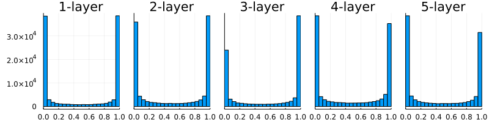
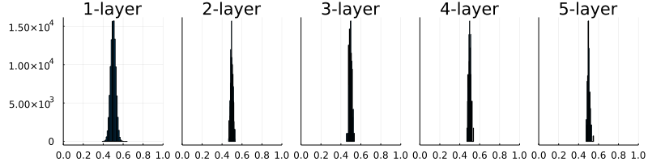
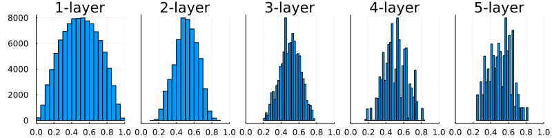
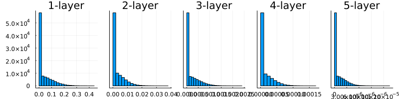
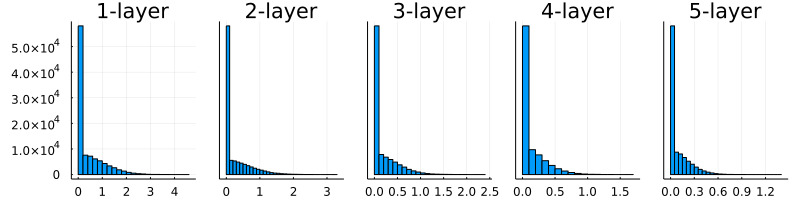
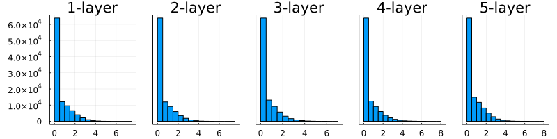
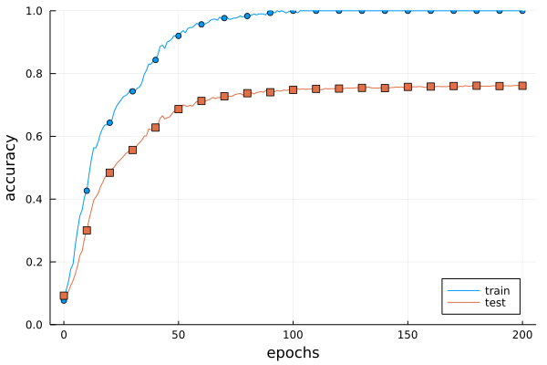
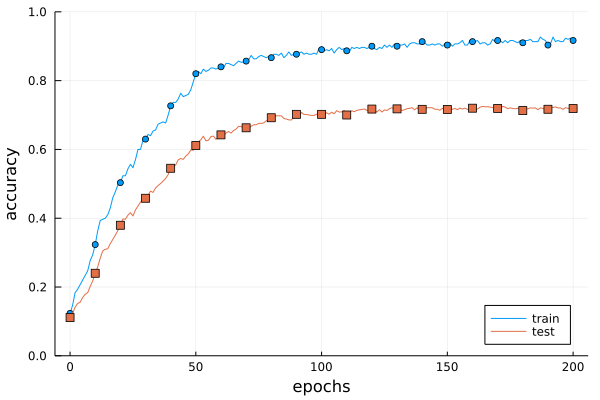

# 6章 学習に関するテクニック
## 6.1 パラメータの更新
### 6.1.1 冒険家の話
### 6.1.2 SGD

```julia
mutable struct SGD
    lr::Float
end
SGD() = SGD(0.01)

function update(self::SGD, params, grads)
    for (key,_)=params
        params[key] .-= self.lr * grads[key]
    end
end
```

～  

```julia
network = TwoLayerNet(...)
optimizer = SGD()

for i = 1:10000
    ...
    x_batch, t_batch = get_mini_batch(...) # ミニバッチ
    grads = gradient(network, x_batch, t_batch)
    params = network.params
    update(optimizer, params, grads)
    ...
end
```

～  

### 6.1.3 SGDの欠点
### 6.1.4 Momentum

～  

```julia
mutable struct Momentum # """Momentum SGD"""
    lr::AbstractFloat
    momentum::AbstractFloat
    v
end
 Momentum(lr=0.01, momentum=0.9) = Momentum(lr, momentum, nothing)
         
function update(self::Momentum, params, grads)
    if isnothing(self.v)
        self.v = IdDict()
        for (key, val) = params
            self.v[key] = zero(val)
        end
    end

    for (key,_) = params
        self.v[key] = self.momentum .* self.v[key] .- self.lr * grads[key] 
        params[key] .+= self.v[key]
    end
end
```

～  

### 6.1.5 AdaGrad

～  

```julia
mutable struct AdaGrad # """AdaGrad"""
    lr::AbstractFloat
    h
end
AdaGrad(lr=0.01) = AdaGrad(lr, nothing)
        
function update(self::AdaGrad, params, grads)
    if isnothing(self.h)
        self.h = IdDict()
        for (key, val) = params
            self.h[key] = zero(val)
        end
    end

    for (key,_) = params
        self.h[key] .+= grads[key].^2
        params[key] .-= self.lr * grads[key] ./ (sqrt.(self.h[key]) + 1e-7)
    end
end
```

～  

### 6.1.6 Adam
### 6.1.7 どの更新手法を用いるか？
### 6.1.8 MNISTデータセットによる更新手法の確認
## 6.2 重みの初期値
### 6.2.1 重みの初期値を0にする？
### 6.2.2 隠れ層のアクティベーション分布

```julia
import OrderedCollections: OrderedDict
using Plots

function sigmoid(x)
    return 1 / (1 + exp(-x))
end

node_num = 100              # 各隠れ層のノード（ニューロン）の数
hidden_layer_size = 5       # 隠れ層が5層
activations = OrderedDict() # ここにアクティベーションの結果を格納する

for i = 1:hidden_layer_size
    if i != 1
        x = activations[i-1]
    else
        x = randn(1000, 100)
    end

    w = randn(node_num, node_num) * 1


    z = x * w
    a = sigmoid.(a) # シグモイド関数！
    activations[i] = a
end
```

～  

```julia
# ヒストグラムを描画
p = []
for (i, a) = activations    
    push!(p, histogram!(a[:], bins=30, xlim=(0,1), title="$i-layer", leg=false))
end
plot(p..., layout=(1,length(activations)))
```

  
図6-10　重みの初期値として標準偏差1のガウス分布を用いたときの、各層のアクティベーションの分布  

～  

```julia
# w = randn(node_num, node_num) * 1
w = randn(node_num, node_num) * 0.01
```

  
図6-11　重みの初期値として標準偏差0.01のガウス分布を用いたときの、各層のアクティベーションの分布  

～  

```julia
node_num = 100  # 前層のノードの数
w = randn(node_num, node_num) / sqrt(node_num)
```

  
図6-13　重みの初期値として「Xavierの初期値」を用いたときの、各層のアクティベーションの分布  

～  

### 6.2.3 ReLUの場合の重みの初期値

～  

  
  
  

### 6.2.4 MNISTデータセットによる重み初期値の比較
## 6.3 Batch Normalization
### 6.3.1 Batch Normalization のアルゴリズム
### 6.3.2 Batch Normalization の評価
## 6.4 正則化
### 6.4.1 過学習

```julia
(x_train, t_train), (x_test, t_test) = load_mnist(normalize=true)

# 過学習を再現するために、学習データを削減
x_train = x_train[1:300, :]
t_train = t_train[1:300]
```

～  

```julia
network = MultiLayerNet(784, [100, 100, 100, 100, 100, 100], 10,
                        weight_decay_lambda=weight_decay_lambda)
optimizer = SGD(0.01) # 学習係数0.01のSGDでパラメータ更新

max_epochs = 201
train_size = size(x_train, 1)
batch_size = 100

train_loss_list = zeros(0)
train_acc_list = zeros(0)
test_acc_list = zeros(0)

iter_per_epoch = max(train_size / batch_size, 1)
epoch_cnt = 0

for i = 0:1000000000
    batch_mask = shuffle(1:train_size)[1:batch_size]
    x_batch = x_train[batch_mask, :]
    t_batch = t_train[batch_mask]

    grads = gradient(network, x_batch, t_batch)
    update(optimizer, network.params, grads)

    if i % iter_per_epoch == 0
        train_acc = accuracy(network, x_train, t_train)
        test_acc = accuracy(network, x_test, t_test)
        append!(train_acc_list, train_acc)
        append!(test_acc_list, test_acc)

        global epoch_cnt += 1
        if epoch_cnt >= max_epochs
            break
        end
    end
end
```

～  

  
図6-20　訓練データ（train）とテストデータ（test）の認識精度の推移  

～  

### 6.4.2 Weight decay

～  

  
図6-21　Weight decayを用いた訓練データ（train）とテストデータ（test）の認識精度の推移  

～  
